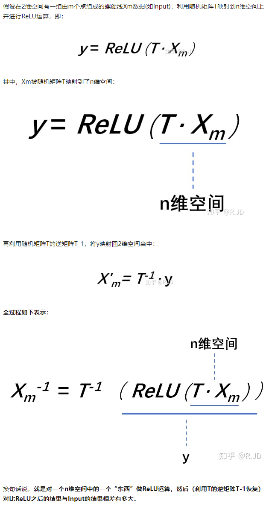

# MobileNet系列

本篇文章主要介绍MobileNet三个系列，即V1，V2，V3，参考了知乎文章：https://zhuanlan.zhihu.com/p/70703846

### MobileNet-v1

对于v1而言，其内容可以概括为在VGG的基础上将普通的卷积替换成为深度可分离卷积：

##### 深度可分离卷积

深度可分离卷积将普通卷积拆分成为一个深度卷积和逐点卷积两个部分：

首先是深度卷积部分：

与标准卷积不同的是，我们将卷积核拆分成为单通道的形式，在不改变输入特征图像的深度的情况下，对每一个通道都进行卷积操作，经过深度卷积之后，输入特征图和输出特征图的通道数是相同的：

下一步是逐点卷积，这一步的主要作用是升高维度或者降低维度。

在下面这个图中，相同的12 * 12 * 3的输入，都需要得到12 * 12 * 256的输出，我们的两种卷积的对比如下：

**深度可分离卷积的重要意义便在于，其使用更少的参数和运算，能够达到相差不是很多的结果！**

那么更少的参数量和计算量具体少了多少呢？

假设我们标准卷积的尺寸是：Dk×Dk×M，那么标准卷积的参数量为：

标准卷积的计算量为（这里Dw和Dh表示输出特征矩阵的长和宽）：

深度可分离卷积的参数量为：这里计算要分为两个部分，分别为深度卷积和逐点卷积：

深度卷积的卷积核尺寸Dk×Dk×M；逐点卷积的卷积核尺寸为1×1×M，一共有N个，所以深度可分离卷积的参数量是：

深度可分离卷积计算量为：

那么总的来说，其计算量下降为：

除此之外，在细节方面，将激活函数改进成为了Relu6，并且在细节上对VGG进行了一些修改（非重点）：

### mobilenet-v2

我们发现深度卷积在训练的过程当中有很多部分的卷积核是空的，作者认为Relu激活函数可能会使得卷积核许多是空的：

对此作者认为对低纬度做Relu运算，很容易有信息的丢失，但是在高维度进行Relu的运算，信息的丢失会很少。当n=2,3的时候，有很大一部分的信息已经丢失了，而当n=15或者30的时候，很多信息还是被保留了下来。

> 对低维度做ReLU运算，很容易造成信息的丢失。而在高维度进行ReLU运算的话，信息的丢失则会很少。

具体而言的过程如下：（参考知乎文章）

针对这个问题，作者将最后一个的Relu6变成线性激活的函数。

除此之外，MobileNetv2引入了类似ResNet的残差连接结构：为了更加充分的利用信息，先用了PW点卷积提高了维度（1*1卷积）

v1和v2的结构对比如下：

