# 优化器

参考：

https://zhuanlan.zhihu.com/p/489706243

http://ningyuwhut.github.io/cn/2020/12/optimization-method-in-nn/

优化器具体可以被分为两类，第一类是非自适应优化器，第二类是自适应的优化器。前者在整个优化过程当中，学习率不变，或者按照时间变化，常见的例如`SGD`，`SGDM`。后者的学习率随着梯度自适应变换，并且尽可能去消去给定全局学习率的影响，这叫做自适应优化器，常见如`Adagrad`，`RMSprop`，`Adam`等。

文章涉及的优化器有：

SGD, SGDM, Adagrad, RMSProp, Adam, AdamW(new)

## 非自适应优化器：

### SGD

原始的SGD每次只随机选择一个样本进行前向传播，然后反向计算梯度，原始SGD的速度非常快。但是缺点也是十分明显的，我们的损失函数可能会有很大的震荡，甚至难以收敛。

和SGD对应的是MBGD（Mini-batch gradient descent），或者有的时候，我们就把MBGD叫做SGD，MBGD每次利用一整个batch的样本，即利用n个样本进行计算。这样的好处是可以降低训练更新时候的方差，也使得收敛更加稳定，另外一方面，像pytorch等框架都对矩阵运算有各种优化，速度也不错。

mini-bactch也有一些缺点：如何选择合适的batch是一个问题，再者mini-batch依旧会陷入局部最小值，或者鞍点的位置。

### SGDM

其全称为SGD with momentum，于1986年提出，具体的公式为：

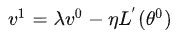

其中 λ 和 η 均为超参数，θ 为模型的参数，具体的参数更新的公式为：

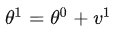

如果我们将 v 初始化为0，那么有：

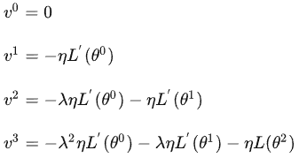 

依次类推，当我们计算到 n 趋向于无穷的时候，会发现之前的梯度影响会越小。这样的方式，综合了之前的梯度的积累，会使得梯度方向不变的方向上，下降速度变快，在梯度方向改变的方向上，下降速度变慢。

# 自适应优化器

### Adagrad

Adagrad随着迭代次数的增加，学习率会进行自动的衰减：

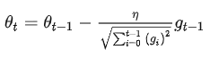

与SGD的区别在于，学习率除以前t-1次迭代的梯度的平方和，所以我们称之为自适应梯度下降。Adagrad也存在着问题，如果刚开始的梯度比较大，那么在训练的后期，学习率基本不会变化，成为了非自适应学习率。（由于累计平方梯度，导致学习率过快接近0）

### RMSProp

RMSProp中修正了之前Adagrad导致的问题，主要在累计平方梯度这个部分做文章：

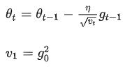

推导一下：

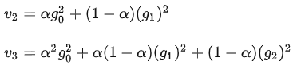

随着迭代次数的增加，v 中较前部分的比例会越占越小，我们只关注几次的平方梯度作为学习率变化的因子，这就解决了在Adagrad方法当中，由于累计平方梯度，最终导致学习率快接近于0的状态。

### Adam

Adam算法是将Momentum核RMSprop两个方法结合起来的方法，并且同时引入了两个参数β1和β2，表达式为：

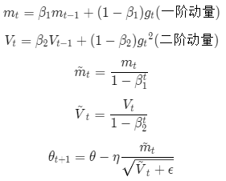

同时考虑到了梯度的衰减，以及动量的累计。

### AdamW

首先需要探讨一下，为什么L2正则又被称之为weight decay的原因，假设我们有一个L2正则的损失函数如下：

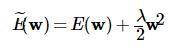

如果我们使用SGD对参数进行更新的话：

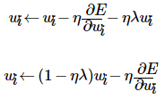

可以发现一个事实是当损失函数加入L2正则之后，参数在更新的时候会减少-ηλwi，这也是L2正则又被称之为weight decay的原因。

**但是weight decay**不相当于L2正则，weight decay的公式如下：

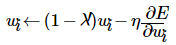

我们可以看到当正则项λ = λ' / η 的时候，使用SGD优化的带有L2正则的loss才和weight decay是等价的。如果有一个全局最优的weight decay权重 λ'，那么正则化系数 λ 的最优值就和学习率 η 绑定在一起了。

**Adam存在的问题**：

Adam虽然收敛的更加快，但是却没有解决参数过拟合的问题，一个直接的解决参数过拟合的手段是在损失函数后面加入L2正则，但是这样的方法可能在上面SGD优化器当中是有效的，但是在Adam当中不一定有效，因为在adam当中，更新权重时会除以历史梯度的平方的加权平均,如果使用L2正则，那么梯度中会加入正则项梯度。而值比较大的参数，它的正则项的梯度也会比较大，此时它的历史梯度的平方的加权平均值会更大，所以相比梯度较小的参数，它的更新值反而会相对来说小一些。这显然是不合理的，因为越大的权重应该惩罚越大，更新值也会越大。但是，在weight decay中，所有参数的更新系数是一样的，所以权重值越大它的惩罚也就越大。

具体而言其实现的伪代码算法如下：

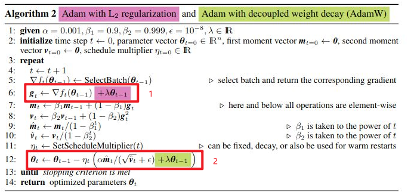

我们加入了绿色部分，缓解了这个问题，这样对于权重较大的选项，我们也能有一个很好的惩罚。